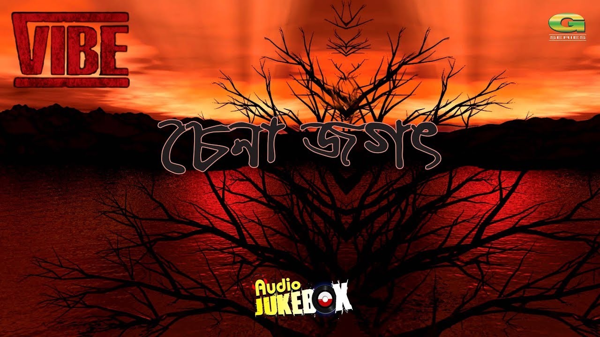

# 🎸 Vibe

[](https://github.com/GhostDog45/BD-Band-Music) [](#) [](#) [](#)

<p align="center">
  
</p>

## 🌟 About the Band

> **Vibe** is a pioneering Bangladeshi heavy metal and alternative rock band formed in Dhaka in 2001. Bursting into prominence during the golden renaissance of Dhaka's underground rock explosion in the mid-2000s, Vibe captivated listeners with their ferocious dual-guitar harmonies, thunderous rhythm section, progressive songwriting structures, and soaring melodic vocals. Featuring frontman Shuddho Fuad Sadi and virtuoso lead guitarist Saleh Hasan Oni (who subsequently joined the legendary Warfaze), Vibe clinched the prestigious Citycell-Channel i Music Award for Best Band in 2007 upon releasing their landmark debut album *Chena Jogot* (চেনা জগৎ). Their music remains an enduring cult classic in Bangladeshi metal history.

---

## 📑 Discography Index

1. [Chena Jogot (চেনা জগৎ) (2007)](#1-chena-jogot-2007)

---

<a id="1-chena-jogot-2007"></a>
## 1. Chena Jogot (চেনা জগৎ) (2007)

- **Band:** Vibe
- **Release Year:** 2007
- **Record Label:** G-Series
- **Audio Quality:** Lossless FLAC (16-bit / 44.1 kHz)

<p align="center">
  
</p>

### 📖 About the Album
Released in 2007 under the prestigious label G-Series, *Chena Jogot* ("Known World") is the critically acclaimed debut and seminal studio album by Vibe. A crowning achievement of 2000s Bangladeshi heavy metal, the record features an extraordinary array of aggressive riffs, introspective lyrics, and memorable melodies across classic anthems like *"Shopnodev"*, *"Shesher Opashe"*, *"Bidhatari Ronge Aka"*, the title track *"Chena Jogot"*, *"Odhora"*, *"Mone Pore"*, *"Ashar Prodip Jole"*, and the poignant ballad *"Nostalgia"* (dedicated to Bangladeshis residing abroad).

### 🎵 Tracklist (One-Tap Download)

- [**01. Shopnodev**](https://media.githubusercontent.com/media/GhostDog45/Vibe/master/VIBE%20-%20CHENA%20JOGOT%20%5BFull%20Album%5D%20%5BFlac%5D/01.%20Shopnodev.flac?download=true) &nbsp; [](https://media.githubusercontent.com/media/GhostDog45/Vibe/master/VIBE%20-%20CHENA%20JOGOT%20%5BFull%20Album%5D%20%5BFlac%5D/01.%20Shopnodev.flac?download=true)
- [**02. Shesher Opashe**](https://media.githubusercontent.com/media/GhostDog45/Vibe/master/VIBE%20-%20CHENA%20JOGOT%20%5BFull%20Album%5D%20%5BFlac%5D/02.%20Shesher%20Opashe.flac?download=true) &nbsp; [](https://media.githubusercontent.com/media/GhostDog45/Vibe/master/VIBE%20-%20CHENA%20JOGOT%20%5BFull%20Album%5D%20%5BFlac%5D/02.%20Shesher%20Opashe.flac?download=true)
- [**03. Bidhatari Ronge Aka**](https://media.githubusercontent.com/media/GhostDog45/Vibe/master/VIBE%20-%20CHENA%20JOGOT%20%5BFull%20Album%5D%20%5BFlac%5D/03.%20Bidhatari%20Ronge%20Aka.flac?download=true) &nbsp; [](https://media.githubusercontent.com/media/GhostDog45/Vibe/master/VIBE%20-%20CHENA%20JOGOT%20%5BFull%20Album%5D%20%5BFlac%5D/03.%20Bidhatari%20Ronge%20Aka.flac?download=true)
- [**04. Chena Jogot**](https://media.githubusercontent.com/media/GhostDog45/Vibe/master/VIBE%20-%20CHENA%20JOGOT%20%5BFull%20Album%5D%20%5BFlac%5D/04.%20Chena%20Jogot.flac?download=true) &nbsp; [](https://media.githubusercontent.com/media/GhostDog45/Vibe/master/VIBE%20-%20CHENA%20JOGOT%20%5BFull%20Album%5D%20%5BFlac%5D/04.%20Chena%20Jogot.flac?download=true)
- [**05. Odhora**](https://media.githubusercontent.com/media/GhostDog45/Vibe/master/VIBE%20-%20CHENA%20JOGOT%20%5BFull%20Album%5D%20%5BFlac%5D/05.%20Odhora.flac?download=true) &nbsp; [](https://media.githubusercontent.com/media/GhostDog45/Vibe/master/VIBE%20-%20CHENA%20JOGOT%20%5BFull%20Album%5D%20%5BFlac%5D/05.%20Odhora.flac?download=true)
- [**06. Mone Pore**](https://media.githubusercontent.com/media/GhostDog45/Vibe/master/VIBE%20-%20CHENA%20JOGOT%20%5BFull%20Album%5D%20%5BFlac%5D/06.%20Mone%20Pore.flac?download=true) &nbsp; [](https://media.githubusercontent.com/media/GhostDog45/Vibe/master/VIBE%20-%20CHENA%20JOGOT%20%5BFull%20Album%5D%20%5BFlac%5D/06.%20Mone%20Pore.flac?download=true)
- [**07. Ashar Prodip Jole**](https://media.githubusercontent.com/media/GhostDog45/Vibe/master/VIBE%20-%20CHENA%20JOGOT%20%5BFull%20Album%5D%20%5BFlac%5D/07.%20Ashar%20Prodip%20Jole.flac?download=true) &nbsp; [](https://media.githubusercontent.com/media/GhostDog45/Vibe/master/VIBE%20-%20CHENA%20JOGOT%20%5BFull%20Album%5D%20%5BFlac%5D/07.%20Ashar%20Prodip%20Jole.flac?download=true)
- [**08. Ure Chole Jai**](https://media.githubusercontent.com/media/GhostDog45/Vibe/master/VIBE%20-%20CHENA%20JOGOT%20%5BFull%20Album%5D%20%5BFlac%5D/08.%20Ure%20Chole%20Jai.flac?download=true) &nbsp; [](https://media.githubusercontent.com/media/GhostDog45/Vibe/master/VIBE%20-%20CHENA%20JOGOT%20%5BFull%20Album%5D%20%5BFlac%5D/08.%20Ure%20Chole%20Jai.flac?download=true)
- [**09. Amar Shongbidhan**](https://media.githubusercontent.com/media/GhostDog45/Vibe/master/VIBE%20-%20CHENA%20JOGOT%20%5BFull%20Album%5D%20%5BFlac%5D/09.%20Amar%20Shongbidhan.flac?download=true) &nbsp; [](https://media.githubusercontent.com/media/GhostDog45/Vibe/master/VIBE%20-%20CHENA%20JOGOT%20%5BFull%20Album%5D%20%5BFlac%5D/09.%20Amar%20Shongbidhan.flac?download=true)
- [**10. Obak Shob Shopno**](https://media.githubusercontent.com/media/GhostDog45/Vibe/master/VIBE%20-%20CHENA%20JOGOT%20%5BFull%20Album%5D%20%5BFlac%5D/10.%20Obak%20Shob%20Shopno.flac?download=true) &nbsp; [](https://media.githubusercontent.com/media/GhostDog45/Vibe/master/VIBE%20-%20CHENA%20JOGOT%20%5BFull%20Album%5D%20%5BFlac%5D/10.%20Obak%20Shob%20Shopno.flac?download=true)
- [**11. Nostalgia**](https://media.githubusercontent.com/media/GhostDog45/Vibe/master/VIBE%20-%20CHENA%20JOGOT%20%5BFull%20Album%5D%20%5BFlac%5D/11.%20Nostalgia.flac?download=true) &nbsp; [](https://media.githubusercontent.com/media/GhostDog45/Vibe/master/VIBE%20-%20CHENA%20JOGOT%20%5BFull%20Album%5D%20%5BFlac%5D/11.%20Nostalgia.flac?download=true)

### 🖼️ Album Artwork

| | |
| :---: | :---: |
| <br><sub><b>1. Front Cover</b></sub> | <br><sub><b>2. Front Cover (Alternative Scan)</b></sub> |
| <br><sub><b>3. Booklet (Part 1)</b></sub> | <br><sub><b>4. Booklet (Part 2)</b></sub> |
| <br><sub><b>5. Promotional Poster & Lyrics</b></sub> | <br><sub><b>6. Tray Inlay Artwork</b></sub> |
| <br><sub><b>7. Inset (Part 4)</b></sub> | <br><sub><b>8. Compact Disc (CD)</b></sub> |
| <br><sub><b>9. Back Cover</b></sub> |  |

---

### 💾 Git LFS & Downloading Audio
All audio tracks in this repository are managed via **Git LFS** (Large File Storage).
- **One-Tap Direct Download:** Click either the track title or the green `Download FLAC` button next to any song to instantly save the lossless FLAC file to your device.
- **To clone the complete discography locally with all FLAC files:**
  ```bash
  git lfs install
  git clone https://github.com/GhostDog45/Vibe.git
  ```
---

### 🙏 Special Thanks & Gratitude
Heartfelt gratitude to **Shohail Ibne Mahbub (XTR)** for his monumental passion and dedication in keeping Bangladeshi band music alive. Through his archival project [**Bangla CD Covers**](https://banglacdcovers.blogspot.com/), he has painstakingly collected, preserved, and scanned original physical CDs and cassette tapes, ensuring that the legacy, artwork, and history of Bangladesh's rock and band movement remain preserved for generations of music lovers.
